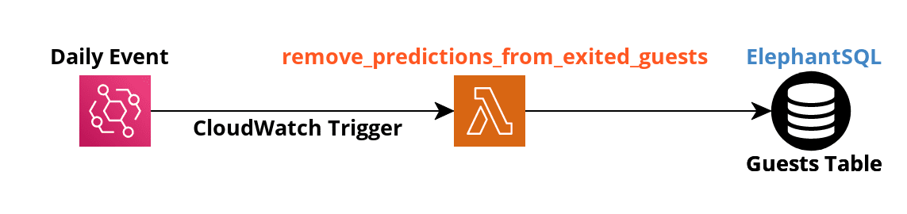
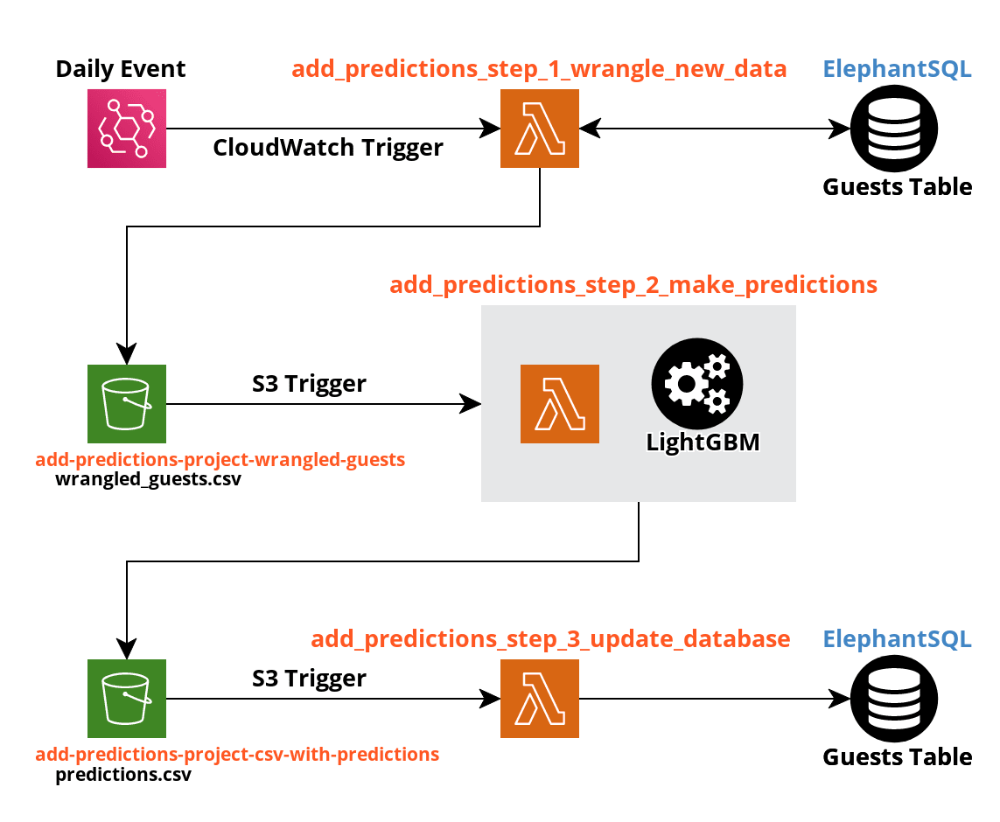

# Family Promise of Spokane Data Engineering

## Project Overview
Serverless backend that uses a deployed LightGBM model hosted on AWS to return and update predictions for guests in our database. These predictions are used to help case workers better prioritize the most vulnerable guests, so that case workers can optimize the allocation of their resources and reduce the number of homeless families in Spokane.

Description of current directories:

- **remove_predictions_from_exited_guests**: single function
   - Checks if `predicted_exit_destination` column exists in guests table and creates it if necessary
   - Updates `predicted_exit_destination` column to account for guests that have recently exited from the shelter
- **add_predictions_to_non_exited_guests**: multiple functions
  1. *add_predictions_step_1_wrangle_new_data*: performs query to retrieve new guest data, wrangles data for modeling, and stores wrangled data in an S3 bucket
  2. *add_predictions_step_2_make_predictions*: retrieves wrangled data, produces predictions with data using a pickled model, and stores results in an S3 bucket
  3. *add_predictions_step_3_update_database*: retrieves prediction data and then updates the guest table's `predicted_exit_destination` column

## Tech Stack
**Languages**: Python, SQL

**Dependencies**: Pandas, NumPy, psycopg2, pickle, Boto3, LightGBM

**Services**: Docker, AWS API Gateway, AWS Lambda, AWS S3, AWS CloudWatch, ElephantSQL, PostgreSQL

## Architecture
### remove_predictions_from_exited_guests


### add_predictions_to_non_exited_guests


## Getting Started
### Deployment to AWS
#### Developer environment
Build Amazon Linux image with Python 3.7 and pip

```docker build -t example_image_name .```

#### Installing dependencies

All dependencies are already installed, but if for some reason you needed to delete and reinstall:

```docker run -v $(pwd):/aws -ti example_image_name```

then

```pip install bcrypt aws-psycopg2 pandas -t /aws```

Do not install if these packages already exist in the aws folder.

#### Packaging Lambda Function
```zip -r example_filename.zip *```

At this point you'll want to head over the AWS GUI for function creation at AWS Lambda. 

### AWS Environment Variables
#### remove_predictions_from_exited_guests
```
RDS_HOST = database host 
RDS_USERNAME = database username
RDS_USER_PWD = database password
```

#### add_predictions_step_1_wrangle_new_data
```
RDS_HOST = database host
RDS_USERNAME = database username
RDS_USER_PWD = database password
S3_BUCKET = destination S3 bucket name for wrangled data
```

#### add_predictions_step_2_make_predictions
```
S3_BUCKET_ORIGIN = S3 bucket name where model and wrangled data are stored
S3_BUCKET_DESTINATION =	destination S3 bucket name for prediction data
MODEL_NAME = model file name
WRANGLED_DATA_FILE = wrangled data file name
```

#### add_predictions_step_3_update_database
```
RDS_HOST = database host
RDS_USERNAME = database username
RDS_USER_PWD = database password
S3_BUCKET_ORIGIN = S3 bucket name where prediction data is stored
PREDICTIONS_FILE = prediction data file name
```

## License
MIT
